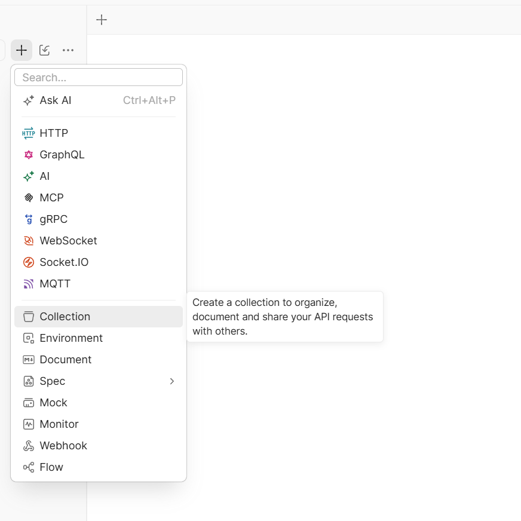
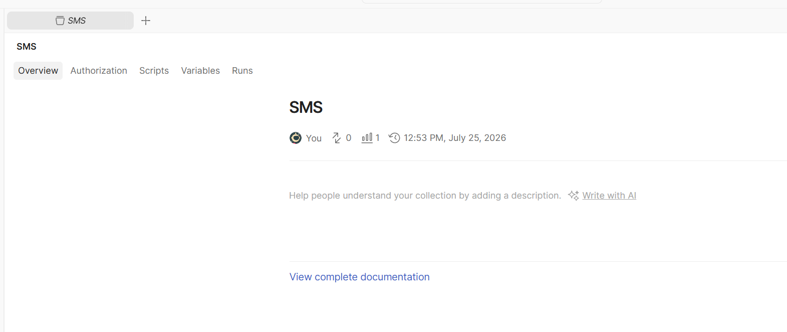
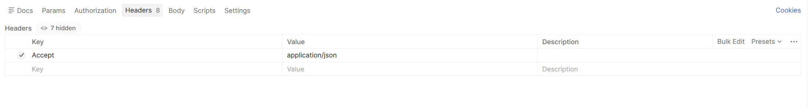
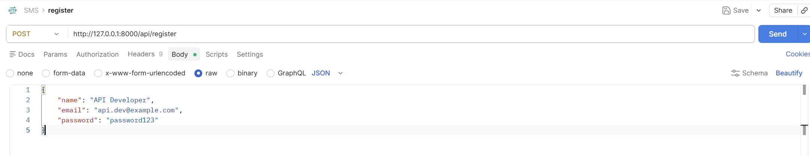
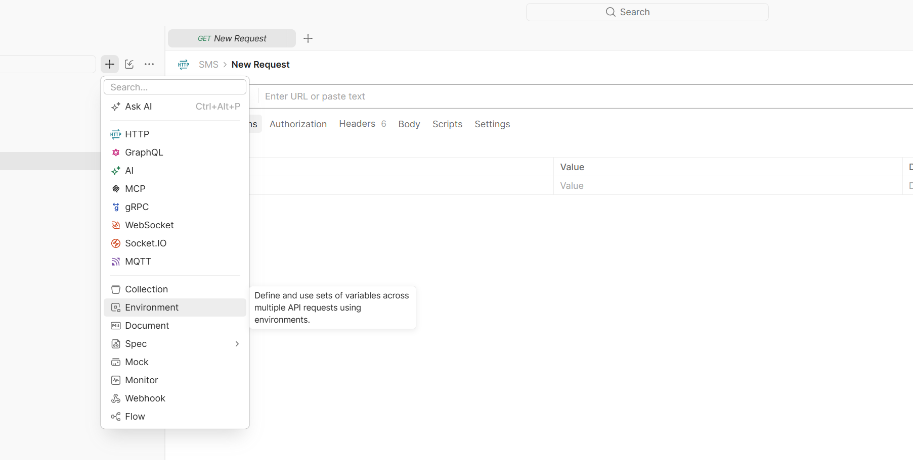
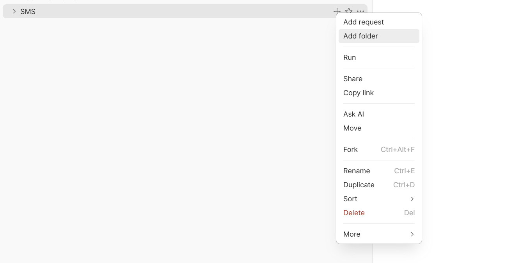
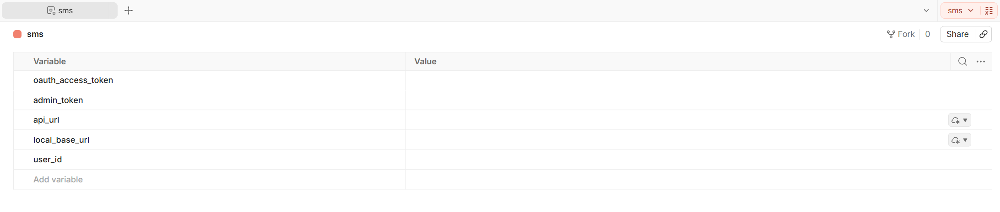

# Lab 6 - Part 02: API Authentication Layer
## Student Management System (Continuation)
### Submission Checklist
* Print each rendered browser page into a PDF file.
* Submit the PDF files via my personal account telegram or group.


## 1. Core API Subsystem Scaffolding & State Synchronization
### Step 1: Install Laravel API Scaffolding
Execute the automated core layout generators to securely provision API routing templates and structural dependencies inside your environment tree:
>Run:

```bash
php artisan install:apiy
```

When prompted by the framework console runtime to automatically authorize script packages and confirm actions, select:

```text
yes
```

This sequence instantiates the dedicated `routes/api.php` file mapping and coordinates core state definitions. Follow this by syncing the database:

>Run:

```bash
php artisan migrate
```

### Step 2. Validate Laravel Sanctum Packages

If the core framework signatures deployed during the previous step did not bundle Sanctum components, manually pull the required dependency into your container:

```bash
composer require laravel/sanctum
```

## 2. Model Infrastructure Updates: Trait Insertion

### Step 1: Attach API Token Capabilities to Core Identities
Inject the specialized Sanctum capability trait directly into your user model class mapper to seamlessly handle cryptographic plain-text authentication tokens.

>File: `app/Models/User.php`

Update it like this:

```php
<?php

namespace App\Models;

use Illuminate\Database\Eloquent\Factories\HasFactory;
use Illuminate\Foundation\Auth\User as Authenticatable;
use Illuminate\Notifications\Notifiable;
use Laravel\Sanctum\HasApiTokens;

class User extends Authenticatable
{
    use HasApiTokens, HasFactory, Notifiable;

    /**
     * The dynamic structural mapping properties allowed for mass assignment arrays.
     */
    protected $fillable = [
        'name',
        'email',
        'password',
    ];

    /**
     * Data fields targeted for systemic masking routines during data transformation loops.
     */
    protected $hidden = [
        'password',
        'remember_token',
    ];

    /**
     * Enforce type-casting parameters cleanly on target field extractions.
     */
    protected function casts(): array
    {
        return [
            'email_verified_at' => 'datetime',
            'password' => 'hashed',
        ];
    }
}
```

## 3. Controller Engine Setup: Independent Endpoint Mappers
### Step 1: Generate Master API Authentication Controller
Construct the dedicated authentication lifecycle gateway engine to evaluate credential schemas and build state tokens safely:

>Run:
```bash
php artisan make:controller Api/AuthController
```

>File: `app/Http/Controllers/Api/AuthController.php`

```php
<?php

namespace App\Http\Controllers\Api;

use App\Http\Controllers\Controller;
use App\Models\User;
use Illuminate\Http\JsonResponse;
use Illuminate\Http\Request;
use Illuminate\Support\Facades\Hash;

class AuthController extends Controller
{
    public function register(Request $request): JsonResponse
    {
        $validated = $request->validate([
            'name' => ['required', 'string', 'max:255'],
            'email' => ['required', 'email', 'unique:users,email'],
            'password' => ['required', 'string', 'min:8'],
        ]);

        $user = User::create([
            'name' => $validated['name'],
            'email' => $validated['email'],
            'password' => Hash::make($validated['password']),
        ]);

        $token = $user->createToken('SMS API Token')->plainTextToken;

        return response()->json([
            'message' => 'User registered successfully.',
            'user' => $user,
            'token' => $token,
            'token_type' => 'Bearer',
        ], 201);
    }

    public function login(Request $request): JsonResponse
    {
        $validated = $request->validate([
            'email' => ['required', 'email'],
            'password' => ['required', 'string'],
        ]);

        $user = User::where('email', $validated['email'])->first();

        if (!$user || !Hash::check($validated['password'], $user->password)) {
            return response()->json([
                'message' => 'Invalid email or password.',
            ], 401);
        }

        $token = $user->createToken('SMS API Token')->plainTextToken;

        return response()->json([
            'message' => 'Login successfully.',
            'user' => $user,
            'token' => $token,
            'token_type' => 'Bearer',
        ]);
    }

    public function me(Request $request): JsonResponse
    {
        return response()->json([
            'user' => $request->user(),
        ]);
    }

    public function logout(Request $request): JsonResponse
    {
        $request->user()->currentAccessToken()->delete();

        return response()->json([
            'message' => 'Logged out successfully.',
        ]);
    }
}
```

### Step 2: Generate Structural Student Data API Controller
Build a fully decoupled resource controller explicitly designed for structured, format-controlled API payload transformations:

Run:

```bash
php artisan make:controller Api/StudentController --api
```

>File: `app/Http/Controllers/Api/StudentController.php`

```php
<?php

namespace App\Http\Controllers\Api;

use App\Http\Controllers\Controller;
use App\Models\Student;
use Illuminate\Http\JsonResponse;
use Illuminate\Http\Request;

class StudentController extends Controller
{
    public function index(Request $request): JsonResponse
    {
        $query = Student::with('gender')->latest();

        if ($request->filled('search')) {
            $query->where(function ($studentQuery) use ($request) {
                $studentQuery->where('name', 'like', '%' . $request->search . '%')
                    ->orWhere('email', 'like', '%' . $request->search . '%')
                    ->orWhere('phone', 'like', '%' . $request->search . '%');
            });
        }

        if ($request->filled('gender_id')) {
            $query->where('gender_id', $request->gender_id);
        }

        return response()->json([
            'message' => 'Student list retrieved successfully.',
            'data' => $query->paginate(10),
        ]);
    }

    public function store(Request $request): JsonResponse
    {
        $validated = $request->validate([
            'name' => ['required', 'string', 'max:255'],
            'email' => ['required', 'email', 'unique:students,email'],
            'phone' => ['nullable', 'string', 'max:20'],
            'gender_id' => ['required', 'exists:genders,id'],
        ]);

        $student = Student::create($validated);
        $student->load('gender');

        return response()->json([
            'message' => 'Student created successfully.',
            'data' => $student,
        ], 201);
    }

    public function show(Student $student): JsonResponse
    {
        $student->load('gender');

        return response()->json([
            'message' => 'Student retrieved successfully.',
            'data' => $student,
        ]);
    }

    public function update(Request $request, Student $student): JsonResponse
    {
        $validated = $request->validate([
            'name' => ['sometimes', 'required', 'string', 'max:255'],
            'email' => ['sometimes', 'required', 'email', 'unique:students,email,' . $student->id],
            'phone' => ['nullable', 'string', 'max:20'],
            'gender_id' => ['sometimes', 'required', 'exists:genders,id'],
        ]);

        $student->update($validated);
        $student->load('gender');

        return response()->json([
            'message' => 'Student updated successfully.',
            'data' => $student,
        ]);
    }

    public function destroy(Student $student): JsonResponse
    {
        $student->delete();

        return response()->json([
            'message' => 'Student deleted successfully.',
        ]);
    }
}
```

### Step 3: Generate Structural Gender Category API Controller
Construct the lightweight reference table endpoint engine to calculate entity counts:

>Run:

```bash
php artisan make:controller Api/GenderController --api
```

>File: `app/Http/Controllers/Api/GenderController.php`

```php
<?php

namespace App\Http\Controllers\Api;

use App\Http\Controllers\Controller;
use App\Models\Gender;
use Illuminate\Http\JsonResponse;

class GenderController extends Controller
{
    public function index(): JsonResponse
    {
        $genders = Gender::withCount('students')
            ->orderBy('name')
            ->get();

        return response()->json([
            'message' => 'Gender list retrieved successfully.',
            'data' => $genders,
        ]);
    }

    public function show(Gender $gender): JsonResponse
    {
        $gender->load('students');

        return response()->json([
            'message' => 'Gender retrieved successfully.',
            'data' => $gender,
        ]);
    }
}
```

## 4. API Routing Infrastructure Strategy

### Configure Access Boundary Control Middleware
Isolate web endpoint arrays from stateless microservice channels. Map authorization gates using the standard sanctum middleware wrapper logic blocks cleanly.

>File: `routes/api.php`


```php
<?php

use App\Http\Controllers\Api\AuthController;
use App\Http\Controllers\Api\GenderController;
use App\Http\Controllers\Api\StudentController;
use Illuminate\Support\Facades\Route;

// Unprotected API entries for initial session establishment vectors
Route::post('/register', [AuthController::class, 'register']);
Route::post('/login', [AuthController::class, 'login']);

// Cryptographically isolated API middleware gate boundary zone
Route::middleware('auth:sanctum')->group(function () {
    
    // Identity verification endpoints
    Route::get('/me', [AuthController::class, 'me']);
    Route::post('/logout', [AuthController::class, 'logout']);

    // Automated API resource routing arrays
    Route::apiResource('students', StudentController::class);

    // Explicit read-only gender dictionary matrices paths
    Route::get('/genders', [GenderController::class, 'index']);
    Route::get('/genders/{gender}', [GenderController::class, 'show']);
});
```

## 5. Microservice Validation Framework (Postman Comprehensive Blueprint)
Ensure your development server is up and running `(php artisan serve)` before following these testing configurations.

### Create New Collection




### Global Prerequisite Configuration Headers
For EVERY Single Request executed within the Postman panel workspace, you must append this key-value parameter under the Headers tab to prevent the application from accidentally returning HTML layouts:
>Key: Accept

>Value: application/json




### Phase A: Public Identity Gate Protocols

### 1. Registration Flow `(POST)`
>URL Target: http://127.0.0.1:8000/api/register

>Body Type Selector: Select raw and set the format parameter option to JSON.

>Payload Structure Array:
```json
{
    "name": "API Developer",
    "email": "api.dev@example.com",
    "password": "password123"
}
```




Expected JSON State Output: Look for a 201 Created status code along with a plain text string inside the "token" parameter node. Copy this key string.

### 2. Authentication Login Matrix Validation (POST)
>URL Target: http://127.0.0.1:8000/api/login

>Body Type Selector: Select raw -> JSON.

>Payload Structure Array:
```json
{
    "email": "api.dev@example.com",
    "password": "password123"
}
```
Expected JSON State Output: A 200 OK response returning your dynamic access token payload block.

### Phase B: Intercepting Protected Operations (Token Authentication)
To interact with any guarded routes below, you must attach your copied token string to the request:
```text
1. Go to the Authorization tab in Postman.
2. Select Bearer Token from the Type dropdown menu.
3. Paste the plain text token string directly into the Token field textbox.
```

### 3. Identity State Retrieval Profile Check (GET)
>URL Target: http://127.0.0.1:8000/api/me

>Authorization Scheme: Bearer Token active.

>Expected JSON State Output: Returns a clean data matrix containing the authorized user record details.

### Phase C: Student Management Directory API Actions
### 4. Fetch Master Student Directory Listing (GET)
>URL Target: http://127.0.0.1:8000/api/students

>Query Parameter Filtering Hooks (Optional): * Add a search key with a query value (e.g., sok) to filter records.

>Add a gender_id key with a numeric value (e.g., 1) to check category links.

Expected JSON State Output: Returns a 200 OK response with a structured, paginated collection of student objects.

### 5. Insert New Student Record Object (POST)
>URL Target: http://127.0.0.1:8000/api/students

>Body Type Selector: Select `raw` -> `JSON.`

Payload Structure Array:
```json
{
    "name": "Sok Chan",
    "email": "chan.sok@example.com",
    "phone": "+85512345678",
    "gender_id": 1
}
```
Expected JSON State Output: A 201 Created response containing the stored record properties along with its auto-assigned database id.

### 6. Detailed Profile Record Extraction (GET)

>URL Target: http://127.0.0.1:8000/api/students/{id} (Replace {id} with a real row number, e.g., http://127.0.0.1:8000/api/students/1)

Expected JSON State Output: Returns a target data package with nested relational details from the gender subtable.

### 7. Active Student Record Modification (PUT)
>URL Target: http://127.0.0.1:8000/api/students/{id} (e.g., /api/students/1)

>Body Type Selector: Select raw -> JSON.

>Payload Structure Array:
```json
{
    "name": "Sok Chan Updated",
    "email": "chan.updated@example.com",
    "gender_id": 2
}
```
Expected JSON State Output: A 200 OK response containing the updated entity values.

### 8. Discard and Delete Student Entity Row (DELETE)
>URL Target: http://127.0.0.1:8000/api/students/{id} (e.g., /api/students/1)

Expected JSON State Output:
```json
{
    "message": "Student deleted successfully."
}
```

### Phase D: Gender Registry Interrogations

### 9. Fetch Gender Summary Map Directory (GET)
>URL Target: http://127.0.0.1:8000/api/genders

Expected JSON State Output: Returns reference records fields along with the calculated total number of matching students (students_count).

### 10. Fetch Single Gender Category Details (GET)
>URL Target: http://127.0.0.1:8000/api/genders/1

Expected JSON State Output: Returns the gender entity details along with a nested array listing all associated student records.

### Phase E: Lifecycle Destruction Testing
### 11. Invalidate Token Session Lifecycle (POST)
>URL Target: http://127.0.0.1:8000/api/logout

>Authorization Scheme: Bearer Token active.

Expected JSON State Output: A 200 OK response confirming the session token has been deleted from the database.

### 12. Security Boundary Isolation Sanity Check (GET)
>URL Target: http://127.0.0.1:8000/api/students

>Authorization Scheme: Leave the Bearer token active, or remove it entirely.

Expected Operational Interception Result: The framework must intercept the request, return a 401 Unauthorized status code, and display the following message payload to confirm that access is blocked:
```json
{
    "message": "Unauthenticated."
}
```

### 1. Registration Flow `(POST)`
>URL Target: http://127.0.0.1:8000/api/register

>Body Type Selector: Select raw and set the format parameter option to JSON.

>Payload Structure Array:
```json
{
    "name": "API Developer",
    "email": "api.dev@example.com",
    "password": "password123"
}
```

### Automated Postman Script Setup (Tests Tab):
#### Create Enviroment





To avoid copying and pasting tokens manually, navigate to the Tests tab inside Postman for the Registration/Login request and paste the following snippet:
```javascript
const responseData = pm.response.json();

if (responseData.token) {
    // Saves the bearer token to your active environment variable
    pm.environment.set("admin_token", responseData.token); 
}

if (responseData.user && responseData.user.id) {
    // Saves the authenticated user ID dynamically
    pm.environment.set("user_id", responseData.user.id);
}
```

Expected JSON State Output: A 201 Created status code along with the generated plain text string token and user ID automatically captured into your Postman environment.

### Insert New Student Record Object (POST)
>URL Target: http://127.0.0.1:8000/api/students 

>Authorization Scheme: Bearer Token set to {{admin_token}}

>Body Type Selector: Select raw -> JSON.

>Payload Structure Array:
```json
{
    "name": "Sok Chan",
    "email": "chan.sok@example.com",
    "phone": "+85512345678",
    "gender_id": 1
}
```

### Automated Postman Script Setup (Tests Tab):
Append this extra snippet inside the Tests tab of this request to automatically capture the newly generated Student ID:
```javascript
const responseData = pm.response.json();

if (responseData.data && responseData.data.id) {
    // Saves the newly created student ID dynamically for show, update, and delete calls
    pm.environment.set("student_id", responseData.data.id);
}
```
Expected JSON State Output: A 201 Created response containing the stored record properties along with its auto-assigned database id saved into {{student_id}}.