# Lab3: ReactJS + Firebase Firestore CRUD (Part01)

### Step01. Create Firebase Project
In this lab, we will use **Firebase Firestore** as our database to store student information instead of using Local Storage.
#### 1. Open Firebase Console
###### Open your browser and visit the following website.
```
https://console.firebase.google.com/
```
#### 2. Create a New Project
Click the **Create a Project** button.

> **Note:** If this is your first Firebase project, you will see **Create a Project**. Otherwise, click **Add Project**.
<p align="center">
    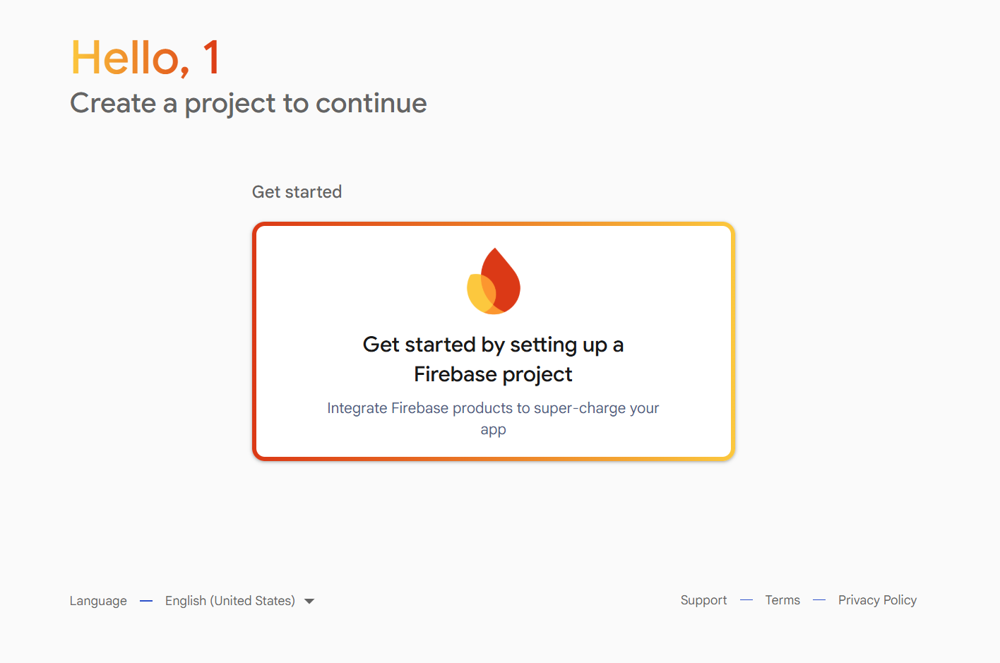
</p>

#### 3. Enter Project Name

> Example: student-management-system
<p align="center">
    
</p>


#### 4. Register Your Web App

###### Inside the Firebase Dashboard

Click

```
</> Web
```
<p align="center">
    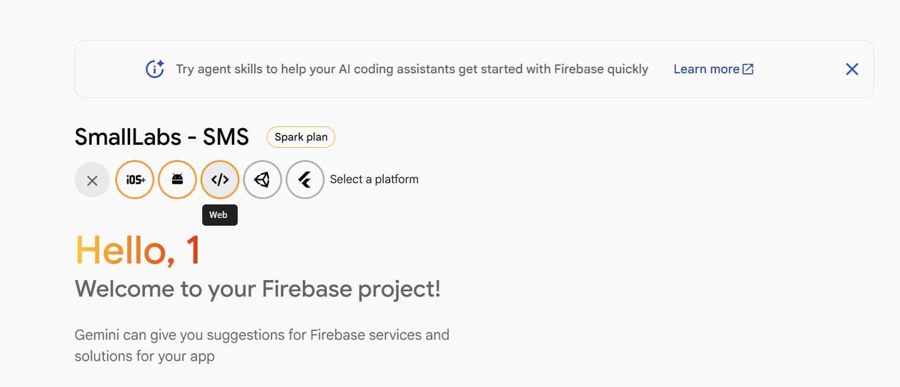
</p>
---

#### 6. App Nickname

Enter

```
student-management
```
<p align="center">
    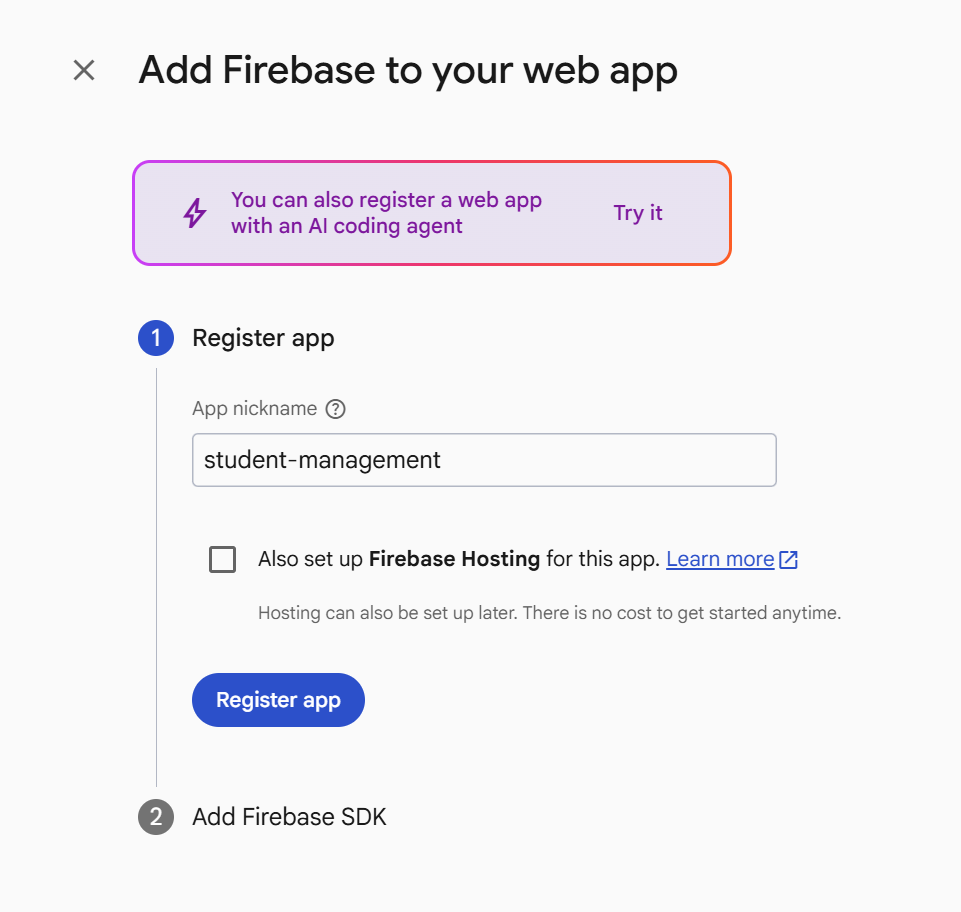
</p>

Click

```
Register App
```

---

## 7. Firebase SDK

Firebase will generate a configuration like this.

```javascript
const firebaseConfig = {
  apiKey: "...",
  authDomain: "...",
  projectId: "...",
  storageBucket: "...",
  messagingSenderId: "...",
  appId: "..."
};
```
**Do not close this page.**
###### We will use this configuration in the next step.

## Step 2. Install Firebase SDK

In this step, we will install the **Firebase SDK** into our React project.

The Firebase SDK allows our React application to communicate with Firebase services such as:

- Firestore Database
- Authentication
- Storage
- Hosting

For this lab, we will only use **Firestore Database**.

---

#### 1. Open Terminal
###### Open your ReactJS project
---
#### 2. Install Firebase

Run the following command.

```bash
npm install firebase
```
###### Wait until the installation is complete.

## Step 3. Create Firebase Configuration
Now that Firebase has been installed, we need to connect our React application to our Firebase project.

In this step, we will:

- Create a **firebase** folder.
- Create **firebaseConfig.js**.
- Initialize Firebase.
- Connect to Firestore Database.
- Export the Firestore instance.

---

#### 1. Create Folder

###### Inside the **src** folder, create a new folder named:

```text
firebase
```

Project Structure

```text
src/
│
├── assets/
├── components/
├── firebase/
├── pages/
├── App.jsx
└── main.jsx
```

---

#### 2. Create File

###### Inside the **firebase** folder, create a new file named:

```text
firebaseConfig.js
```

Project Structure

```text
src/
│
├── firebase/
│   └── firebaseConfig.js
```
---
###### 3. Copy Firebase Configuration
```javascript
const firebaseConfig = {
  apiKey: "YOUR_API_KEY",
  authDomain: "YOUR_PROJECT.firebaseapp.com",
  projectId: "YOUR_PROJECT_ID",
  storageBucket: "YOUR_PROJECT.appspot.com",
  messagingSenderId: "123456789",
  appId: "1:123456789:web:xxxxxxxxxxxxx"
};
```
Copy the configuration.

> **Note:** Everyone will have a different Firebase configuration.

## 4. Update firebaseConfig.js

Replace the content of **src/firebase/firebaseConfig.js** with the following code.

```javascript
import { initializeApp } from "firebase/app";
import { getFirestore } from "firebase/firestore";

// Replace this configuration with your own Firebase project configuration.
const firebaseConfig = {
  apiKey: "YOUR_API_KEY",
  authDomain: "YOUR_PROJECT.firebaseapp.com",
  projectId: "YOUR_PROJECT_ID",
  storageBucket: "YOUR_PROJECT.appspot.com",
  messagingSenderId: "123456789",
  appId: "1:123456789:web:xxxxxxxxxxxxx"
};

// Initialize Firebase
const app = initializeApp(firebaseConfig);

// Initialize Firestore
const db = getFirestore(app);

// Export Firestore
export { db };
```

---

## Step 4. Enable Firestore Database

In this step, we will create a **Cloud Firestore Database**.

Firestore is a **NoSQL cloud database** provided by Firebase.

We will use Firestore to store all student information.

---

#### 1. Open Firestore Database

###### Go to the Firebase Console.

###### Select your Firebase Project.

From the left menu, click

```
Firestore Database
```

<p align="center">
    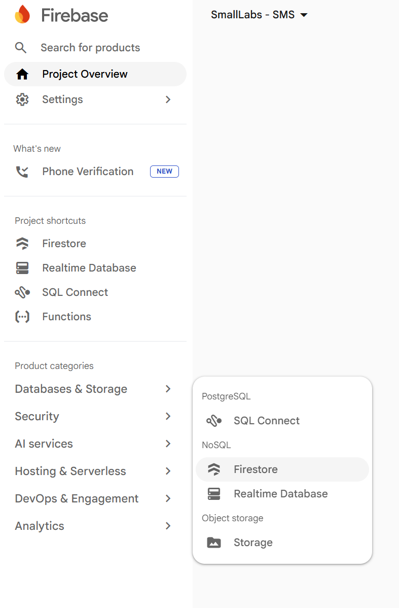
</p>


<p align="center">
    
</p>


Click

```
Create Database
```
<p align="center">
    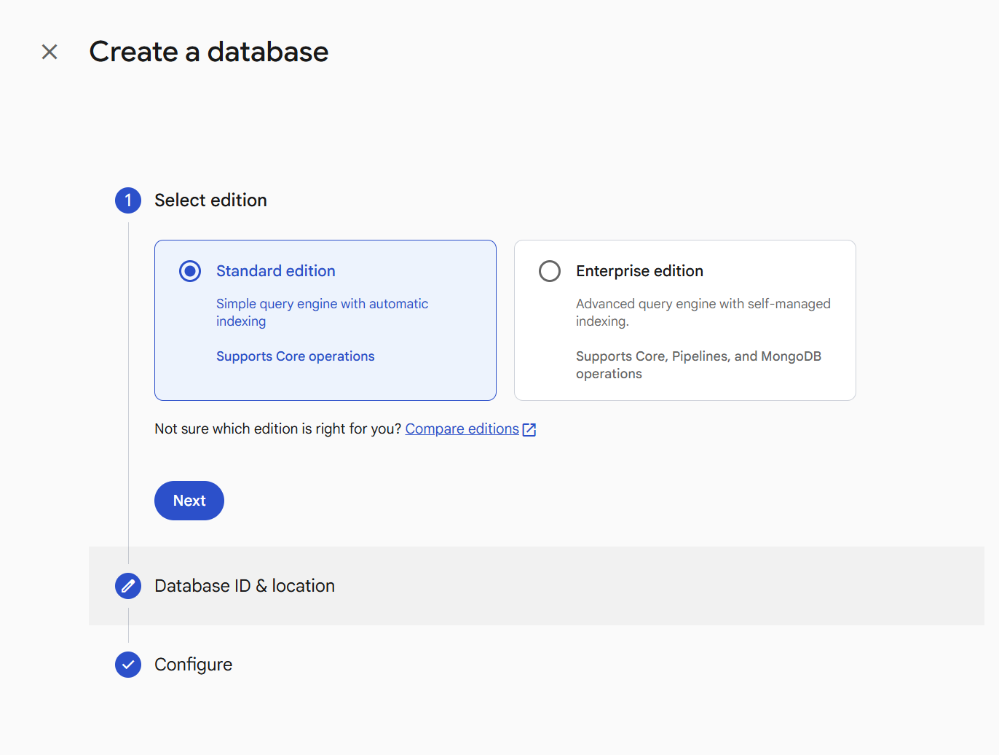
</p>

## 3. Choose Database Location

Select a location that is closest to your country.

Example

```
asia-southeast1 (Singapore)
```

or any location recommended by Firebase.

<p align="center">
    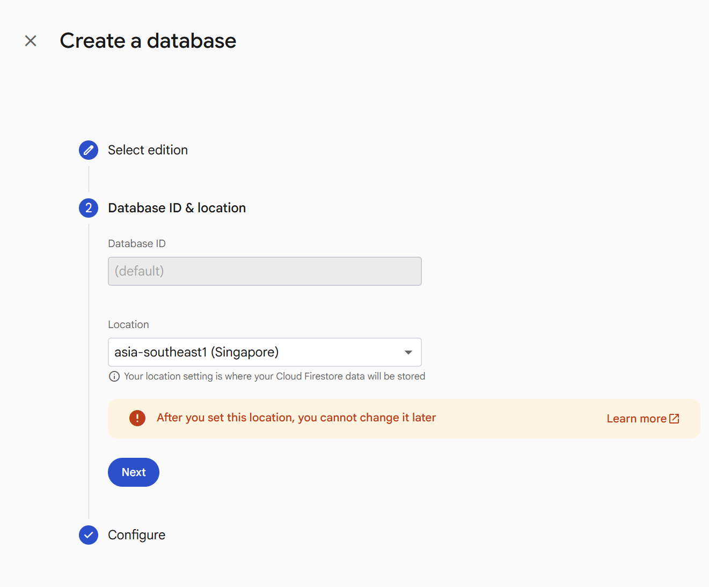
</p>

---

#### 2. Choose Security Rules

###### Firebase will ask you to choose the security mode.

Select

```
Start in Test Mode
```
<p align="center">
    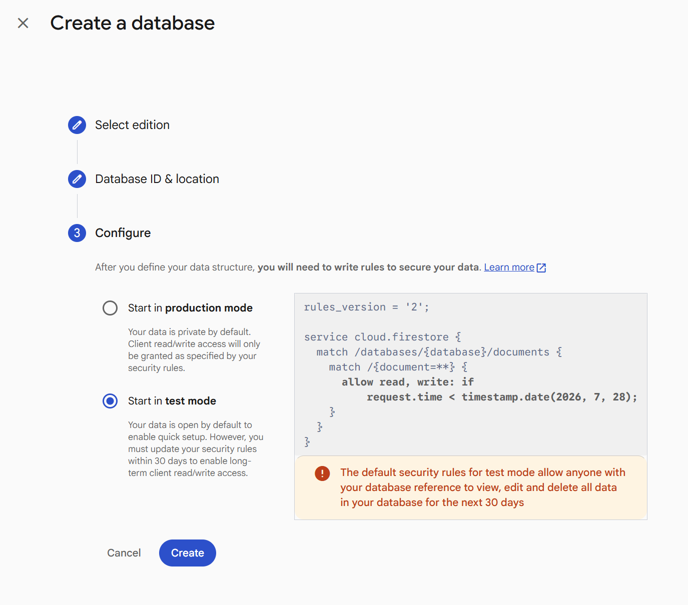
</p>

Click

```
Create
```

> **Note**
>
> We are using **Test Mode** because this is a laboratory exercise.
>
> For production applications, you should always configure proper security rules.

###### Wait a few seconds for Firestore to finish creating the database.

---

#### 5. Create the First Collection

Click

```
Start Collection
```
<p align="center">
    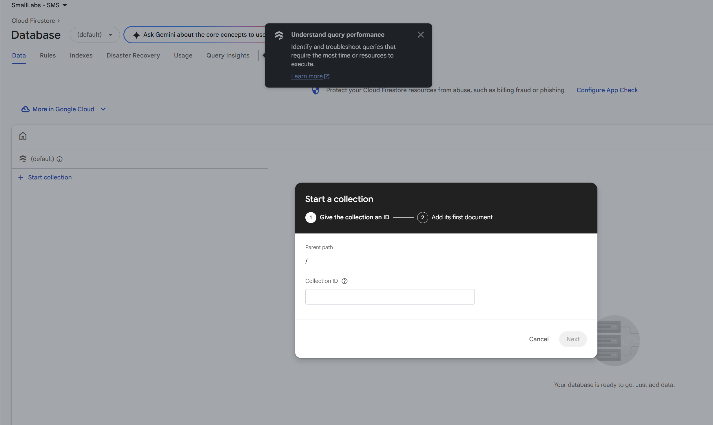
</p>

Collection ID

```
students
```
<p align="center">
    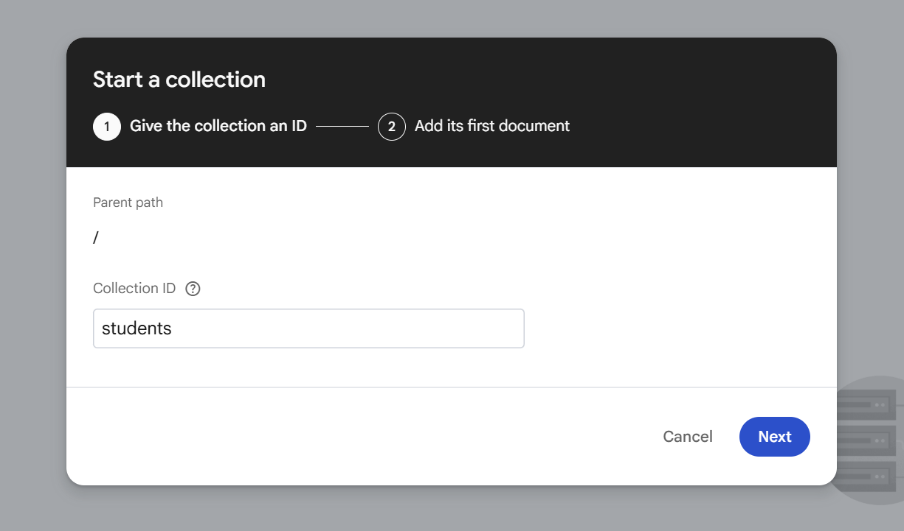
</p>

Click

```
Next
```
---

#### 6. Create the First Document

For the document ID,

Select

```
Auto-ID
```
<p align="center">
    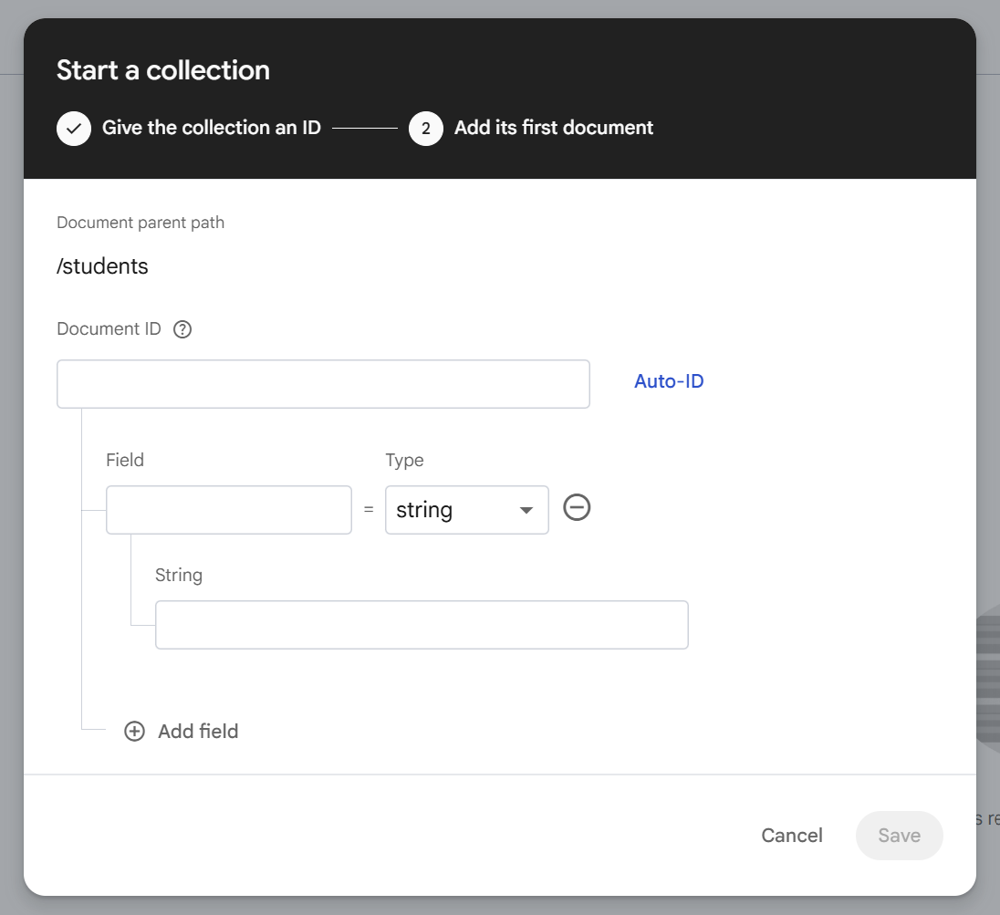
</p>

Firebase will automatically generate a unique document ID.

<p align="center">
    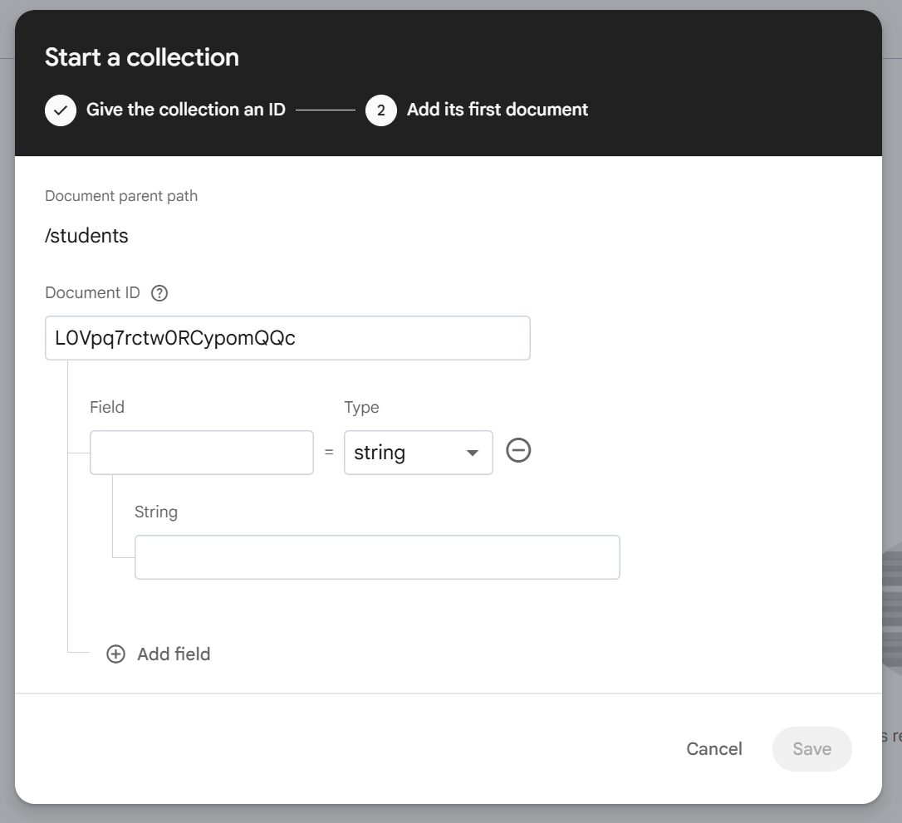
</p>

---

#### 7. Add Student Fields

Create the following fields.

| Field     | Type   | Value                  |
| --------- | ------ | ---------------------- |
| studentId | string | ST001                  |
| fullName  | string | John Doe               |
| gender    | string | Male                   |
| email     | string | john@example.com       |
| phone     | string | 012345678              |
| major     | string | Information Technology |
| year      | number | 3                      |
| status    | string | Active                 |


After entering all fields,

<p align="center">
    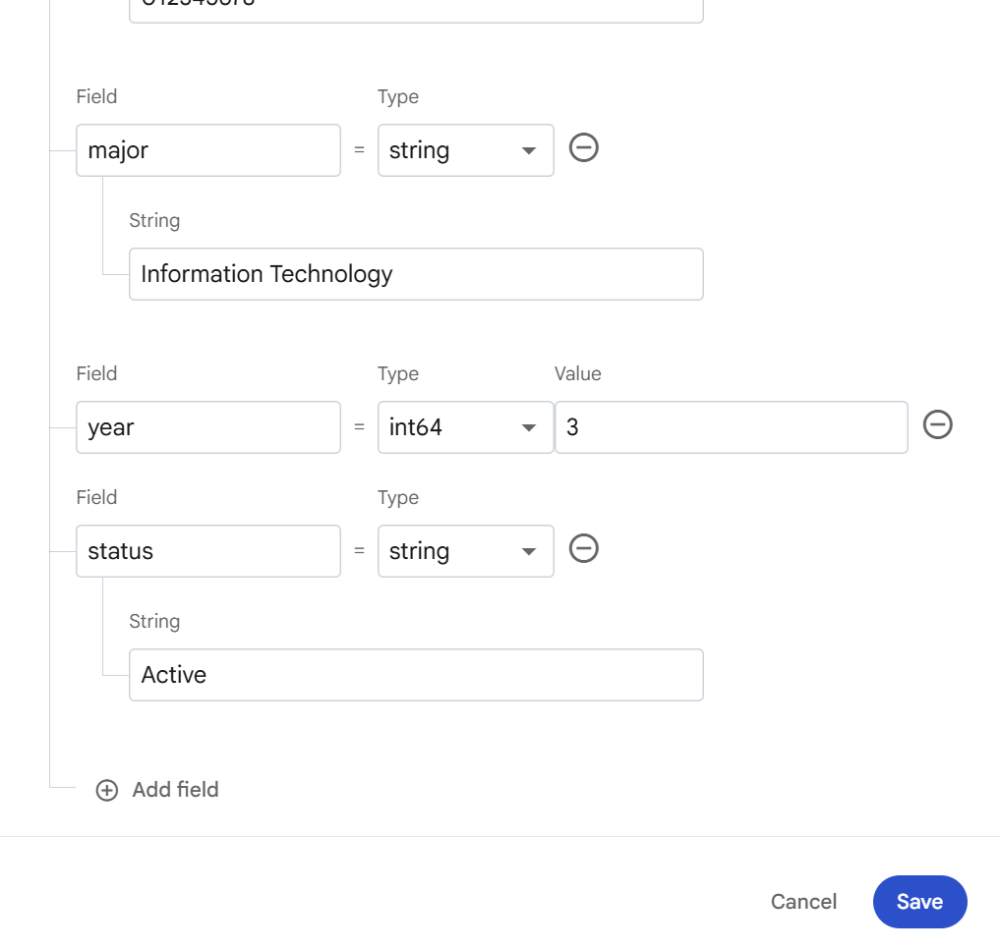
</p>


Click

```
Save
```

Your Firestore Database should now look like this.
<p align="center">
    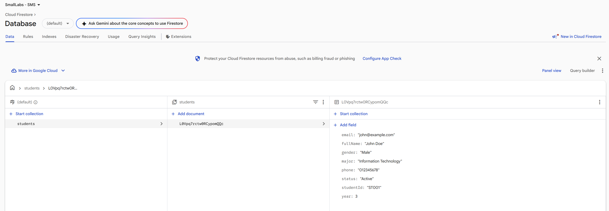
</p>

---

## Step 5. Create Student Service
Instead of writing Firebase code inside React components, we will create a **Service Layer**.

A Service Layer helps us organize our code by separating database operations from the user interface.

In this lab, all Firestore operations will be stored inside:

```text
src/services/studentService.js
```
---

#### 1. Create Folder

Inside the **src** folder, create a new folder named:

```text
services
```

Project Structure

```text
src/
│
├── assets/
├── components/
├── firebase/
│   └── firebaseConfig.js
├── pages/
├── services/
└── App.jsx
```
---

#### 2. Create File

Inside the **services** folder, create a new file named

```text
studentService.js
```

Project Structure

```text
src/
│
├── services/
│   └── studentService.js
```

---

#### 3. Import Firestore Functions

Open **studentService.js** and add the following code.

```javascript
import { db } from "../firebase/firebaseConfig";

import {
  collection,
  addDoc,
  getDocs,
  updateDoc,
  deleteDoc,
  doc,
  query,
  orderBy
} from "firebase/firestore";
```

These functions allow us to communicate with Firestore.

---

#### 4. Create Collection Reference

Below the import statements, add the following code.

```javascript
const studentCollection = collection(db, "students");
```

This line tells Firebase that all operations will work with the **students** collection.

---
#### 5. Create addStudent()

Add the following function.

```javascript
export async function addStudent(student) {
  await addDoc(studentCollection, student);
}
```

- Receives a student object.
- Saves the student into Firestore.
- Firebase automatically creates the Document ID.

---

#### 6. Create getStudents()

Add the following function.

```javascript
export async function getStudents() {
  const q = query(studentCollection, orderBy("studentId"));

  const snapshot = await getDocs(q);

  return snapshot.docs.map(doc => ({
    id: doc.id,
    ...doc.data()
  }));
}
```

This function

- Reads every student.
- Sorts by Student ID.
- Returns an array of students.

---

#### 7. Create updateStudent()

Add the following function.

```javascript
export async function updateStudent(id, student) {
  const studentDoc = doc(db, "students", id);

  await updateDoc(studentDoc, student);
}
```

This function

- Finds a student by Document ID.
- Updates the student's information.

---

#### 8. Create deleteStudent()

Add the following function.

```javascript
export async function deleteStudent(id) {
  const studentDoc = doc(db, "students", id);

  await deleteDoc(studentDoc);
}
```

This function

- Finds the student document.
- Deletes it from Firestore.

---

#### 9. Complete studentService.js

Your **studentService.js** should now look like this.

```javascript
import { db } from "../firebase/firebaseConfig";
import {
  collection,
  addDoc,
  getDocs,
  updateDoc,
  deleteDoc,
  doc,
  query,
  orderBy
} from "firebase/firestore";

const col = collection(db, "students");

export const studentService = {

  async getAll() {
    const q = query(col, orderBy("studentId"));
    const snap = await getDocs(q);

    return snap.docs.map(d => ({
      id: d.id,
      ...d.data()
    }));
  },

  async create(data) {
    await addDoc(col, data);
  },

  async update(id, data) {
    const ref = doc(db, "students", id);
    await updateDoc(ref, data);
  },

  async remove(id) {
    const ref = doc(db, "students", id);
    await deleteDoc(ref);
  }

};
```

---

## Why Do We Use a Service Layer?

Without a Service Layer

```text
DashboardPage.jsx
    ↓
Firebase Code
```

Every React component would contain Firebase code, making the project difficult to maintain.

With a Service Layer

```text
DashboardPage.jsx
        ↓
studentService.js
        ↓
Firestore Database
```

The React components only call functions such as

```javascript
addStudent()

getStudents()

updateStudent()

deleteStudent()
```

This keeps the project clean, organized, and easier to maintain.

---