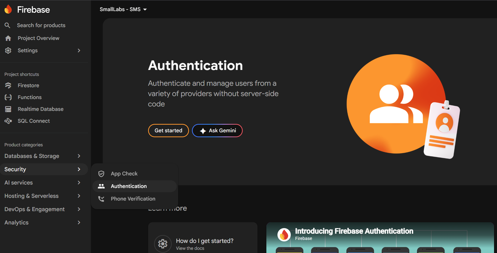
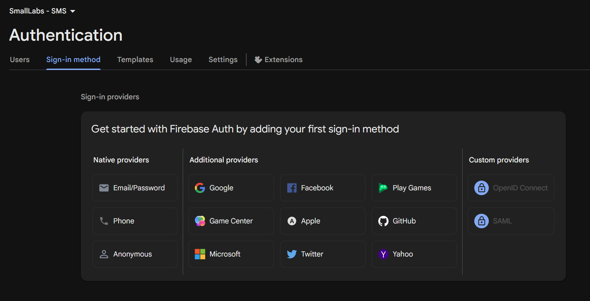
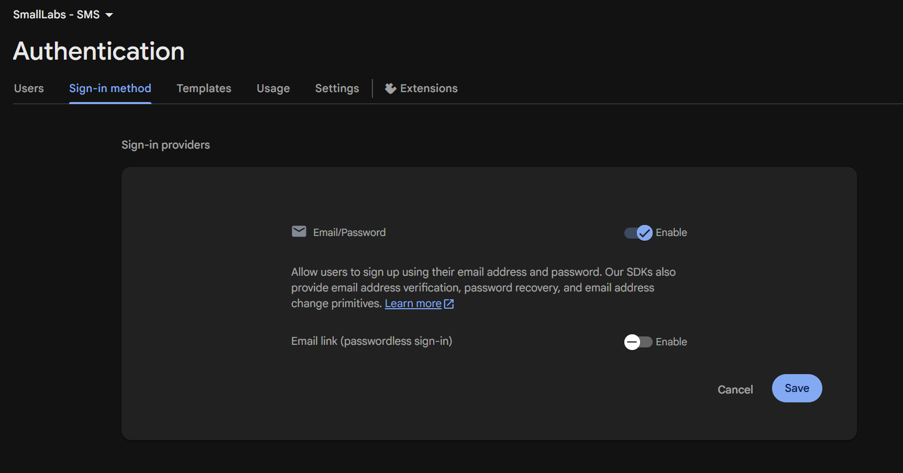

# Lab3 – Part 2: Dashboard Layout & Student Management ( CRUD )
## Updated Project Structure
>**Note** : Create file

```
src/
│
├── components/
│   ├── Form.jsx       
│   ├── Table.jsx       
│   ├── Modal.jsx       
│
├── hooks/
│   └── useCrud.js     
│   └── useAuth.js     
│
├── context/
│   └── AuthContext.jsx
│
├── layouts/
│   ├── PublicLayout.jsx
│   └── DashboardLayout.jsx
│
├── pages/
│   ├── HomePage.jsx
│   ├── LoginPage.jsx
│   ├── RegisterPage.jsx
│   ├── DashboardPage.jsx
│   └── StudentPage.jsx
│
├── routes/
│   └── ProtectedRoute.jsx
│
├── services/
│   └── studentService.js
```
## Step 1: Enable Firebase Authentication
1. Open your project: smalllabs-sms
2. In the left menu, click **Security**
3. Select **Authentication**

<p align="center">
    
</p>

4. Click **Get started**
<p align="center">
    
</p>

5. Enable **Email/Password**
<p align="center">
    
</p>

>Click on **Save**

---
## Step 2: Create Reusble Model
```text
src/components/Modal.jsx
```
```javascript
export default function Modal({ open, onClose, children }) {
  if (!open) return null;

  return (
    <div className="fixed inset-0 bg-black/40 flex items-center justify-center">
      <div className="bg-white p-6 rounded-lg w-[500px]">
        
        <div className="flex justify-between mb-3">
          <h2 className="font-bold">Update Data</h2>

          <button onClick={onClose} className="text-red-500">
            ✕
          </button>
        </div>

        {children}

      </div>
    </div>
  );
}
```
---

## Step 3: Create Reusable CRUD Hook
```text
src/hooks/useCrud.js
```
```javascript
import { useCallback, useEffect, useState } from "react";

export default function useCrud(service) {

  const [data, setData] = useState([]);
  const [loading, setLoading] = useState(true);
  const [error, setError] = useState(null);

  // =========================
  // LOAD DATA
  // =========================
  const load = useCallback(async () => {
    setLoading(true);
    setError(null);

    try {
      const res = await service.getAll();
      setData(res);
    } catch (err) {
      console.error("CRUD Load Error:", err);
      setError(err.message || "Something went wrong");
    } finally {
      setLoading(false);
    }

  }, [service]);

  // =========================
  // INIT LOAD
  // =========================
  useEffect(() => {
    load();
  }, [load]);

  // =========================
  // CREATE
  // =========================
  const create = async (item) => {
    try {
      await service.create(item);
      await load();
    } catch (err) {
      console.error("Create Error:", err);
    }
  };

  // =========================
  // UPDATE
  // =========================
  const update = async (id, item) => {
    try {
      await service.update(id, item);
      await load();
    } catch (err) {
      console.error("Update Error:", err);
    }
  };

  // =========================
  // DELETE
  // =========================
  const remove = async (id) => {
    try {
      await service.remove(id);
      await load();
    } catch (err) {
      console.error("Delete Error:", err);
    }
  };

  // =========================
  // RETURN API
  // =========================
  return {
    data,
    loading,
    error,
    create,
    update,
    remove,
    reload: load
  };
}
```
---
## Step 4: Create Reusable Auth Hook
```text
src/hooks/useAuth.js
```
```javascript
import { useContext } from "react";
import AuthContext from "../context/AuthContext";

export default function useAuth() {
  return useContext(AuthContext);
}
```

## Step 5: Create Auth System
```text
src/context/AuthContext.jsx
```
```javascript
import { createContext } from "react";

const AuthContext = createContext(null);

export default AuthContext;
```
```text
src/context/AuthProvider.jsx
```
```javascript
import { useEffect, useState } from "react";
import AuthContext from "./AuthContext";

import {
  createUserWithEmailAndPassword,
  signInWithEmailAndPassword,
  signOut,
  onAuthStateChanged,
} from "firebase/auth";

import { auth } from "../firebase/firebaseConfig";

export default function AuthProvider({ children }) {
  const [user, setUser] = useState(null);
  const [loading, setLoading] = useState(true);

  const register = (email, password) =>
    createUserWithEmailAndPassword(auth, email, password);

  const login = (email, password) =>
    signInWithEmailAndPassword(auth, email, password);

  const logout = () => signOut(auth);

  useEffect(() => {
    const unsubscribe = onAuthStateChanged(auth, (currentUser) => {
      setUser(currentUser);
      setLoading(false);
    });

    return unsubscribe;
  }, []);

  return (
    <AuthContext.Provider
      value={{
        user,
        loading,
        register,
        login,
        logout,
      }}
    >
      {children}
    </AuthContext.Provider>
  );
}
```

---
## Step 6: Create Reusable Table
```text
src/components/Table.jsx
```
```javascript
import React from "react";

export default function Table({ columns, data = [], onEdit, onDelete }) {
  return (
    <div className="w-full overflow-x-auto rounded-xl border border-gray-200 bg-white">
      <table className="w-full text-left border-collapse text-sm text-gray-600">
        
        {/* Table Header */}
        <thead className="bg-gray-50 text-xs font-semibold uppercase tracking-wider text-gray-700 border-b border-gray-200">
          <tr>
            {columns.map((col, index) => (
              <th key={index} className="px-6 py-4 font-medium">
                {col.header}
              </th>
            ))}
            {(onEdit || onDelete) && (
              <th className="px-6 py-4 font-medium text-right">Actions</th>
            )}
          </tr>
        </thead>

        {/* Table Body */}
        <tbody className="divide-y divide-gray-200">
          {data.length === 0 ? (
            <tr>
              <td
                colSpan={columns.length + (onEdit || onDelete ? 1 : 0)}
                className="px-6 py-10 text-center text-gray-400 font-medium"
              >
                No records found.
              </td>
            </tr>
          ) : (
            data.map((item, rowIndex) => (
              <tr key={item.id || rowIndex} className="hover:bg-gray-50 transition duration-150">
                {columns.map((col, colIndex) => (
                  <td key={colIndex} className="px-6 py-4 whitespace-nowrap text-gray-900 font-medium">
                    {/* Render custom cell template if provided, otherwise fallback to object key */}
                    {col.render ? col.render(item) : item[col.accessor]}
                  </td>
                ))}

                {/* Row Actions */}
                {(onEdit || onDelete) && (
                  <td className="px-6 py-4 whitespace-nowrap text-right space-x-2">
                    {onEdit && (
                      <button
                        onClick={() => onEdit(item)}
                        className="inline-flex items-center px-3 py-1.5 text-xs font-semibold text-yellow-700 bg-yellow-50 hover:bg-yellow-100 rounded-lg transition duration-150"
                      >
                        Edit
                      </button>
                    )}
                    {onDelete && (
                      <button
                        onClick={() => onDelete(item.id)}
                        className="inline-flex items-center px-3 py-1.5 text-xs font-semibold text-red-700 bg-red-50 hover:bg-red-100 rounded-lg transition duration-150"
                      >
                        Delete
                      </button>
                    )}
                  </td>
                )}
              </tr>
            ))
          )}
        </tbody>
      </table>
    </div>
  );
}
```
---

## Step 7: CREATE STUDENT PAGE Create Student Page
```text
src/pages/StudentsPage.jsx
```
```javascript
import { useState } from "react";
import useCrud from "../hooks/useCrud";
import { studentService } from "../services/studentService";

import Table from "../components/Table";
import Modal from "../components/Modal";

export default function StudentPage() {
  const { data = [], loading, create, update, remove } = useCrud(studentService);

  const [form, setForm] = useState({
    studentId: "",
    fullName: "",
    gender: "Male",
    email: "",
    phone: "",
    major: "",
    year: 1,
    status: "Active"
  });

  const [open, setOpen] = useState(false);
  const [editId, setEditId] = useState(null);

  const studentColumns = [
    { header: "ID", accessor: "studentId" },
    { header: "Name", accessor: "fullName" },
    { header: "Gender", accessor: "gender" },
    { header: "Email", accessor: "email" },
    { header: "Phone", accessor: "phone" },
    { header: "Major", accessor: "major" },
    { header: "Year", accessor: "year" },
    { 
      header: "Status", 
      accessor: "status",
      render: (item) => (
        <span className={`inline-flex items-center px-2.5 py-0.5 rounded-full text-xs font-medium ${
          item.status === "Active" ? "bg-green-100 text-green-800" : "bg-red-100 text-red-800"
        }`}>
          {item.status}
        </span>
      )
    },
  ];

  // Helper Function: Generates the next sequential ID (e.g., "ST001", "ST002")
  function generateNextId(currentData) {
    if (!currentData || currentData.length === 0) return "ST001";
    
    // Extract the numbers from all valid studentIds
    const numericIds = currentData
      .map(item => {
        const match = item.studentId?.match(/\d+/);
        return match ? parseInt(match[0], 10) : 0;
      })
      .filter(id => !isNaN(id));

    const maxId = numericIds.length > 0 ? Math.max(...numericIds) : 0;
    const nextId = maxId + 1;
    
    // Pads number with zeros to ensure standard 3-digit formatting (ST001)
    return `ST${String(nextId).padStart(3, "0")}`;
  }

  function handleChange(e) {
    const value = e.target.type === "number" ? Number(e.target.value) : e.target.value;
    setForm({ ...form, [e.target.name]: value });
  }

  // Resets form and applies auto-generated ID if we are creating a new record
  function initNewForm() {
    setForm({
      studentId: generateNextId(data), // Auto-generation fallback logic
      fullName: "",
      gender: "Male",
      email: "",
      phone: "",
      major: "",
      year: 1,
      status: "Active"
    });
  }

  async function handleSubmit(e) {
    e.preventDefault();
    try {
      if (editId) {
        await update(editId, form);
      } else {
        await create(form);
      }
      setOpen(false);
      setEditId(null);
    } catch (error) {
      alert(error.message || "An error occurred");
    }
  }

  function handleEdit(item) {
    setForm(item);
    setEditId(item.id);
    setOpen(true);
  }

  return (
    <div className="p-6 max-w-7xl mx-auto min-h-screen">
      
      {/* HEADER SECTION */}
      <div className="flex flex-col sm:flex-row sm:items-center sm:justify-between pb-6 mb-6 border-b border-gray-200 gap-4">
        <div>
          <h1 className="text-2xl font-bold text-gray-900">Student Directory</h1>
          <p className="text-sm text-gray-500">Manage records, information, and academic status.</p>
        </div>
        
        {/* ADD BUTTON */}
        <button
          onClick={() => {
            initNewForm(); // Triggers auto-generation on open
            setEditId(null);
            setOpen(true);
          }}
          className="inline-flex items-center justify-center rounded-lg bg-blue-600 px-4 py-2.5 text-sm font-semibold text-white hover:bg-blue-700 transition duration-200"
        >
          <svg className="w-5 h-5 mr-1.5 -ml-1" fill="none" viewBox="0 0 24 24" strokeWidth="2.5" stroke="currentColor">
            <path strokeLinecap="round" strokeLinejoin="round" d="M12 4.5v15m7.5-7.5h-15" />
          </svg>
          Add Student
        </button>
      </div>

      {/* TABLE LOADING / CONTENT */}
      <div>
        {loading ? (
          <div className="bg-white rounded-2xl border border-gray-200 p-8 text-center text-gray-500 shadow-sm">
            Loading student profiles...
          </div>
        ) : (
          <Table 
            columns={studentColumns} 
            data={data} 
            onEdit={handleEdit} 
            onDelete={remove} 
          />
        )}
      </div>

      {/* MODAL (MANAGEMENT FORM) */}
      <Modal open={open} onClose={() => setOpen(false)}>
        <div className="p-2 max-w-lg mx-auto">
          <h2 className="text-xl font-bold text-gray-800 mb-5">
            {editId ? "Update Student Profile" : "Register New Student"}
          </h2>

          <form onSubmit={handleSubmit} className="space-y-4">
            
            <div className="grid grid-cols-1 sm:grid-cols-2 gap-4">
              <div>
                <label className="block text-sm font-medium text-gray-700 mb-1">Student ID</label>
                <input
                  name="studentId"
                  value={form.studentId}
                  onChange={handleChange}
                  placeholder="Auto-generating..."
                  className={`w-full rounded-lg border px-4 py-2.5 text-sm focus:outline-none ${
                    editId 
                      ? "bg-gray-50 text-gray-500 border-gray-300 cursor-not-allowed" 
                      : "bg-gray-100 font-semibold text-blue-700 border-blue-200 focus:ring-0"
                  }`}
                  readOnly // Prevents user manual modification while entering new entries
                />
              </div>
              <div>
                <label className="block text-sm font-medium text-gray-700 mb-1">Full Name</label>
                <input
                  name="fullName"
                  value={form.fullName}
                  onChange={handleChange}
                  placeholder="John Doe"
                  className="w-full rounded-lg border border-gray-300 px-4 py-2.5 text-sm focus:outline-none focus:ring-2 focus:ring-blue-600 focus:border-blue-600"
                  required
                />
              </div>
            </div>

            <div className="grid grid-cols-1 sm:grid-cols-2 gap-4">
              <div>
                <label className="block text-sm font-medium text-gray-700 mb-1">Gender</label>
                <select
                  name="gender"
                  value={form.gender}
                  onChange={handleChange}
                  className="w-full rounded-lg border border-gray-300 px-4 py-2.5 text-sm focus:outline-none focus:ring-2 focus:ring-blue-600 focus:border-blue-600"
                >
                  <option value="Male">Male</option>
                  <option value="Female">Female</option>
                  <option value="Other">Other</option>
                </select>
              </div>
              <div>
                <label className="block text-sm font-medium text-gray-700 mb-1">Phone Number</label>
                <input
                  type="tel"
                  name="phone"
                  value={form.phone}
                  onChange={handleChange}
                  placeholder="e.g., 012345678"
                  className="w-full rounded-lg border border-gray-300 px-4 py-2.5 text-sm focus:outline-none focus:ring-2 focus:ring-blue-600 focus:border-blue-600"
                  required
                />
              </div>
            </div>

            <div>
              <label className="block text-sm font-medium text-gray-700 mb-1">Email Address</label>
              <input
                type="email"
                name="email"
                value={form.email}
                onChange={handleChange}
                placeholder="john@example.com"
                className="w-full rounded-lg border border-gray-300 px-4 py-2.5 text-sm focus:outline-none focus:ring-2 focus:ring-blue-600 focus:border-blue-600"
                required
              />
            </div>

            <div>
              <label className="block text-sm font-medium text-gray-700 mb-1">Academic Major</label>
              <input
                name="major"
                value={form.major}
                onChange={handleChange}
                placeholder="Information Technology"
                className="w-full rounded-lg border border-gray-300 px-4 py-2.5 text-sm focus:outline-none focus:ring-2 focus:ring-blue-600 focus:border-blue-600"
                required
              />
            </div>

            <div className="grid grid-cols-1 sm:grid-cols-2 gap-4">
              <div>
                <label className="block text-sm font-medium text-gray-700 mb-1">Academic Year</label>
                <input
                  type="number"
                  name="year"
                  min="1"
                  max="7"
                  value={form.year}
                  onChange={handleChange}
                  className="w-full rounded-lg border border-gray-300 px-4 py-2.5 text-sm focus:outline-none focus:ring-2 focus:ring-blue-600 focus:border-blue-600"
                  required
                />
              </div>
              <div>
                <label className="block text-sm font-medium text-gray-700 mb-1">Status</label>
                <select
                  name="status"
                  value={form.status}
                  onChange={handleChange}
                  className="w-full rounded-lg border border-gray-300 px-4 py-2.5 text-sm focus:outline-none focus:ring-2 focus:ring-blue-600 focus:border-blue-600"
                >
                  <option value="Active">Active</option>
                  <option value="Inactive">Inactive</option>
                  <option value="Suspended">Suspended</option>
                </select>
              </div>
            </div>

            <div className="pt-4">
              <button 
                type="submit"
                className={`w-full rounded-lg py-2.5 text-white font-semibold transition duration-200 ${
                  editId ? "bg-green-600 hover:bg-green-700" : "bg-blue-600 hover:bg-blue-700"
                }`}
              >
                {editId ? "Save Changes" : "Create Student Account"}
              </button>
            </div>
          </form>
        </div>
      </Modal>

    </div>
  );
}
```

## Step 8: PROTECTED ROUTE
```text
scr/routes/ProtectedRoute.jsx
```
```javascript
import { Navigate } from "react-router-dom";
import useAuth from "../hooks/useAuth";

export default function ProtectedRoute({ children }) {
  const { user, loading } = useAuth();

  if (loading) {
    return <h1>Loading...</h1>;
  }

  return user ? children : <Navigate to="/login" replace />;
}
```

## Step 9: CREATE LAYOUT SYSTEM
```text
src/layouts/PublicLayout.jsx
```
```javascript
import Navbar from "../components/Navbar";
import Footer from "../components/Footer";

export default function PublicLayout({ children }) {
  return (
    <>
      <Navbar />
      <main className="min-h-screen flex flex-col">
        {children}
      </main>
      <Footer />
    </>
  );
}
```
```text
src/layouts/DashboardLayout.jsx
```
```javascript
import Sidebar from "../components/Sidebar";
import DashboardHeader from "../components/DashboardHeader";

export default function DashboardLayout({ children }) {
  return (
    <div className="flex min-h-screen bg-slate-100">

      {/* Sidebar */}
      <Sidebar />

      {/* Main Area */}
      <div className="flex-1">

        <DashboardHeader />

        <div className="p-6">
          {children}
        </div>

      </div>

    </div>
  );
}
```

----

## Step 10: UPDATE SIDEBAR
```text
components/Sidebar.jsx
```
```javascript
import { NavLink } from "react-router-dom";

export default function Sidebar() {
  const menus = [
    { name: "Dashboard", path: "/dashboard" },
    { name: "Students", path: "/students" }
  ];

  return (
    <aside className="w-64 bg-white border-r border-gray-300 p-4">

      <h1 className="text-xl font-bold mb-6 text-blue-600">
        Admin Panel
      </h1>

      <nav className="space-y-2">
        {menus.map((m) => (
          <NavLink
            key={m.path}
            to={m.path}
            className={({ isActive }) =>
              isActive
                ? "block p-2 bg-blue-600 text-white rounded"
                : "block p-2 hover:bg-gray-100 rounded"
            }
          >
            {m.name}
          </NavLink>
        ))}
      </nav>

    </aside>
  );
}
```
---

## Step 11: Update App.jsx
```text
App.jsx
```
```javascript
import { Routes, Route, Navigate } from "react-router-dom";

import PublicLayout from "./layouts/PublicLayout";
import DashboardLayout from "./layouts/DashboardLayout";

import ProtectedRoute from "./routes/ProtectedRoute";

import HomePage from "./pages/HomePage";
import LoginPage from "./pages/LoginPage";
import RegisterPage from "./pages/RegisterPage";

import DashboardPage from "./pages/DashboardPage";
import StudentPage from "./pages/StudentsPage";

import AuthProvider from "./context/AuthProvider";

function App() {
  return (
    <AuthProvider>

      <Routes>

        {/* PUBLIC */}
        <Route
          path="/"
          element={
            <PublicLayout>
              <HomePage />
            </PublicLayout>
          }
        />

        <Route
          path="/login"
          element={
            <PublicLayout>
              <LoginPage />
            </PublicLayout>
          }
        />

        <Route
          path="/register"
          element={
            <PublicLayout>
              <RegisterPage />
            </PublicLayout>
          }
        />

        {/* DASHBOARD */}
        <Route
          path="/dashboard"
          element={
            <ProtectedRoute>
              <DashboardLayout>
                <DashboardPage />
              </DashboardLayout>
            </ProtectedRoute>
          }
        />

        <Route
          path="/students"
          element={
            <ProtectedRoute>
              <DashboardLayout>
                <StudentPage />
              </DashboardLayout>
            </ProtectedRoute>
          }
        />

        {/* fallback */}
        <Route path="*" element={<Navigate to="/" />} />

      </Routes>

    </AuthProvider>
  );
}

export default App;
```
---

## Step 12: Update DashboardPage.jsx
```text
src/pages/DashboardPage.jsx
```
```javascript
import { useEffect, useMemo, useState } from "react";

import StatCard from "../components/StatCard";
import ProfileCard from "../components/ProfileCard";
import ActivityList from "../components/ActivityList";

import { studentService } from "../services/studentService";
import useAuth from "../hooks/useAuth";

export default function DashboardPage() {
  const { user } = useAuth();

  const [students, setStudents] = useState([]);
  const [loading, setLoading] = useState(true);

  useEffect(() => {
    loadStudents();
  }, []);

  async function loadStudents() {
    try {
      setLoading(true);

      const data = await studentService.getAll();

      setStudents(data);
    } catch (error) {
      console.error(error);
    } finally {
      setLoading(false);
    }
  }

  // Dashboard statistics
  const stats = useMemo(() => {
    return [
      {
        title: "Total Students",
        value: students.length,
        color: "bg-blue-600"
      },
      {
        title: "Active Students",
        value: students.filter(
          student => student.status === "Active"
        ).length,
        color: "bg-green-600"
      },
      {
        title: "Inactive Students",
        value: students.filter(
          student => student.status === "Inactive"
        ).length,
        color: "bg-red-500"
      },
      {
        title: "IT Major",
        value: students.filter(
          student => student.major === "Information Technology"
        ).length,
        color: "bg-purple-600"
      }
    ];
  }, [students]);

  // Recent students
  const activities = useMemo(() => {
    return students
      .slice(0, 5)
      .map(
        student =>
          `${student.studentId} - ${student.fullName}`
      );
  }, [students]);

  // Logged in user
  const profile = {
    name: user?.displayName || "Administrator",
    email: user?.email || "No Email",
    role: "Administrator"
  };

  return (
    <div className="min-h-screen bg-slate-100">

      <main className="p-6 space-y-6">

        <div>
          <h1 className="text-3xl font-bold text-slate-800">
            Dashboard
          </h1>

          <p className="text-slate-500 mt-1">
            Welcome back, {profile.name}
          </p>
        </div>

        {loading ? (

          <div className="flex justify-center items-center h-60">

            <div className="text-lg text-gray-500">
              Loading Dashboard...
            </div>

          </div>

        ) : (

          <>
            {/* Statistics */}

            <div className="grid grid-cols-1 md:grid-cols-2 xl:grid-cols-4 gap-6">

              {stats.map((item, index) => (
                <StatCard
                  key={index}
                  title={item.title}
                  value={item.value}
                  color={item.color}
                />
              ))}

            </div>

            {/* Profile + Activity */}

            <div className="grid grid-cols-1 xl:grid-cols-3 gap-6">

              <ProfileCard user={profile} />

              <ActivityList
                activities={
                  activities.length
                    ? activities
                    : ["No recent student records."]
                }
              />

            </div>

          </>

        )}

      </main>

    </div>
  );
}
```
---

## Step 13: Update Register Page
```text
src/pages/RegisterPage.jsx
```
```javascript
import { useState } from "react";
import { useNavigate, Link } from "react-router-dom";
import useAuth from "../hooks/useAuth";

export default function RegisterPage() {
  const { register } = useAuth();
  const navigate = useNavigate();

  const [form, setForm] = useState({
    email: "",
    password: ""
  });

  function handleChange(e) {
    setForm({ ...form, [e.target.name]: e.target.value });
  }

  async function handleSubmit(e) {
    e.preventDefault();

    try {
      await register(form.email, form.password);
      alert("Account created!");
      navigate("/dashboard");
    } catch (error) {
      alert(error.message);
    }
  }

  return (
    <section className="flex-1 flex items-center justify-center bg-gray-100 px-4 min-h-screen">
      <div className="w-full max-w-md bg-white rounded-2xl border border-gray-300 p-8">
        <h2 className="text-3xl font-bold text-center text-gray-800 mb-2">
          Create Account
        </h2>

        <form className="space-y-5" onSubmit={handleSubmit}>
          <div>
            <label className="block text-sm font-medium text-gray-700 mb-1">
              Email Address
            </label>
            <input
              type="email"
              name="email"
              placeholder="you@example.com"
              value={form.email} // Matched with your 'form' state
              onChange={handleChange}
              className="w-full rounded-lg border border-gray-300 px-4 py-2.5 text-sm focus:outline-none focus:ring-2 focus:ring-blue-600 focus:border-blue-600"
              required
            />
          </div>

          <div>
            <label className="block text-sm font-medium text-gray-700 mb-1">
              Password
            </label>
            <input
              type="password"
              name="password"
              placeholder="••••••••"
              value={form.password} // Matched with your 'form' state
              onChange={handleChange}
              className="w-full rounded-lg border border-gray-300 px-4 py-2.5 text-sm focus:outline-none focus:ring-2 focus:ring-blue-600 focus:border-blue-600"
              required
            />
          </div>

          <button
            type="submit"
            className="w-full rounded-lg bg-blue-600 py-2.5 text-white font-semibold hover:bg-blue-700 transition duration-200"
          >
            Create Account
          </button>
        </form>

        <p className="mt-6 text-center text-sm text-gray-600">
          Already have an account?{" "}
          <Link
            to="/login"
            className="font-medium text-blue-600 hover:underline"
          >
            Login
          </Link>
        </p>
      </div>
    </section>
  );
}
```
## Step 14: Update Login Page
```text
src/pages/LoginPage.jsx
```
```javascript
import { Link, useNavigate } from "react-router-dom";
import { useState } from "react";
import useAuth from "../hooks/useAuth";

export default function LoginPage() {
  const navigate = useNavigate();
  const { login } = useAuth();

  const [formData, setFormData] = useState({
    email: "",
    password: ""
  });

  const [loading, setLoading] = useState(false);

  function handleChange(e) {
    setFormData({
      ...formData,
      [e.target.name]: e.target.value
    });
  }

  async function handleSubmit(e) {
    e.preventDefault();

    setLoading(true);

    try {
      await login(formData.email, formData.password);

      alert("Login successful!");

      navigate("/dashboard");
    } catch (error) {
      switch (error.code) {
        case "auth/invalid-credential":
          alert("Invalid email or password.");
          break;

        case "auth/user-not-found":
          alert("User not found.");
          break;

        case "auth/wrong-password":
          alert("Incorrect password.");
          break;

        case "auth/invalid-email":
          alert("Invalid email format.");
          break;

        default:
          alert(error.message);
      }
    } finally {
      setLoading(false);
    }
  }

  return (
    <section className="flex-1 flex items-center justify-center bg-gray-100 px-4">
      <div className="w-full max-w-md bg-white rounded-2xl border border-gray-200 p-8">

        <h2 className="text-3xl font-bold text-center text-gray-800 mb-1">
          Welcome Back
        </h2>

        <p className="text-center text-sm text-gray-500 mb-6">
          Login to your account
        </p>

        <form className="space-y-5" onSubmit={handleSubmit}>

          <div>
            <label className="block text-sm font-medium text-gray-700 mb-1">
              Email Address
            </label>

            <input
              type="email"
              name="email"
              placeholder="you@example.com"
              value={formData.email}
              onChange={handleChange}
              required
              className="w-full rounded-lg border border-gray-300 px-4 py-2.5 text-sm
                         focus:outline-none focus:ring-2 focus:ring-blue-600 focus:border-blue-600"
            />
          </div>

          <div>
            <label className="block text-sm font-medium text-gray-700 mb-1">
              Password
            </label>

            <input
              type="password"
              name="password"
              placeholder="••••••••"
              value={formData.password}
              onChange={handleChange}
              required
              className="w-full rounded-lg border border-gray-300 px-4 py-2.5 text-sm
                         focus:outline-none focus:ring-2 focus:ring-blue-600 focus:border-blue-600"
            />
          </div>

          <button
            type="submit"
            disabled={loading}
            className="w-full rounded-lg bg-blue-600 py-2.5 text-white font-semibold hover:bg-blue-700 transition duration-200 disabled:bg-gray-400"
          >
            {loading ? "Signing In..." : "Sign In"}
          </button>

        </form>

        <p className="mt-6 text-center text-sm text-gray-600">
          Don't have an account?{" "}
          <Link
            to="/register"
            className="font-medium text-blue-600 hover:underline"
          >
            Register
          </Link>
        </p>

      </div>
    </section>
  );
}
```