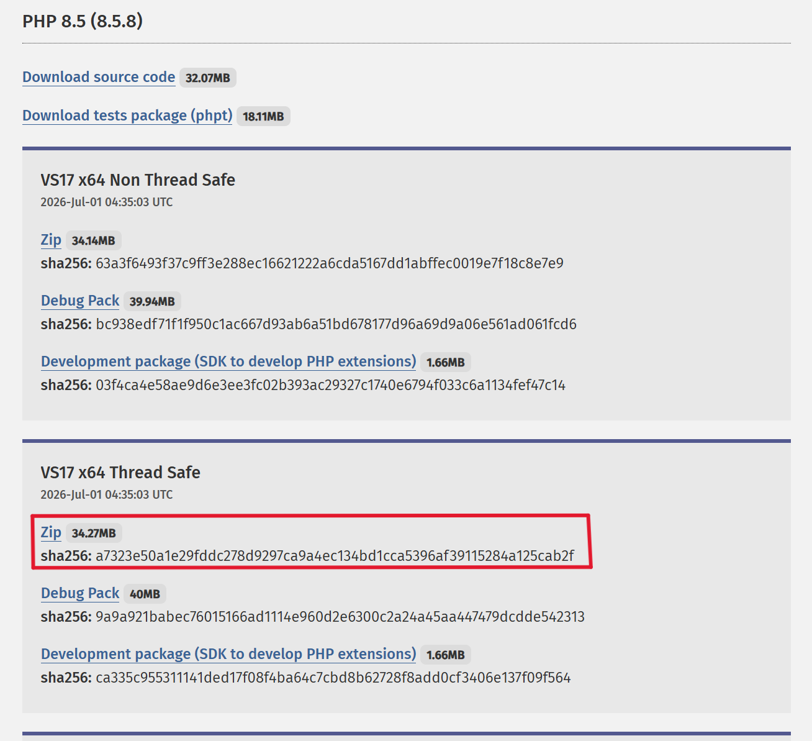
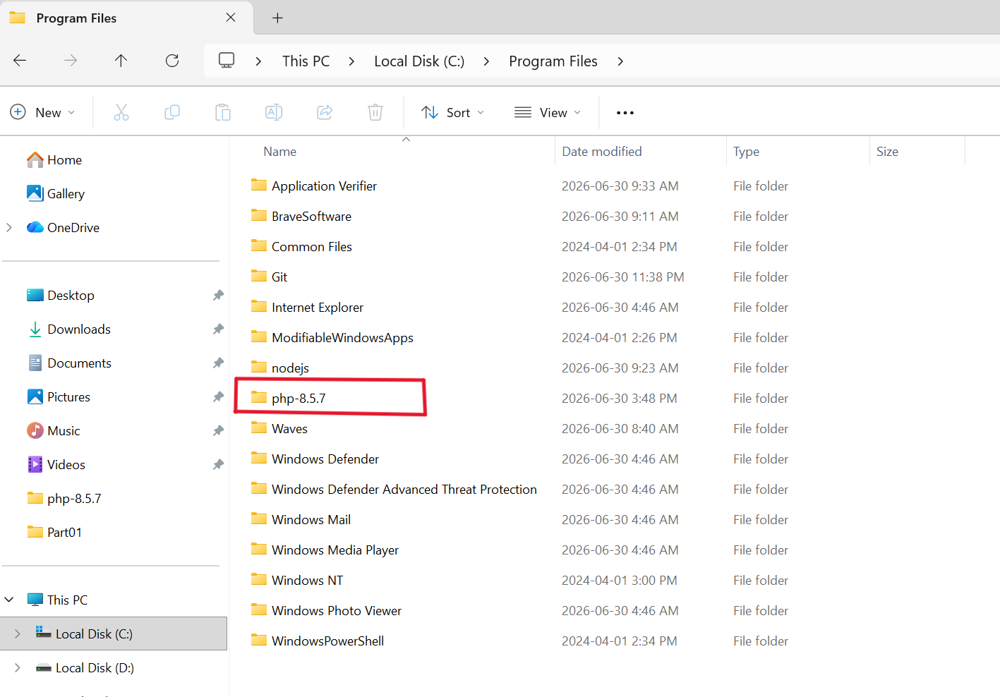
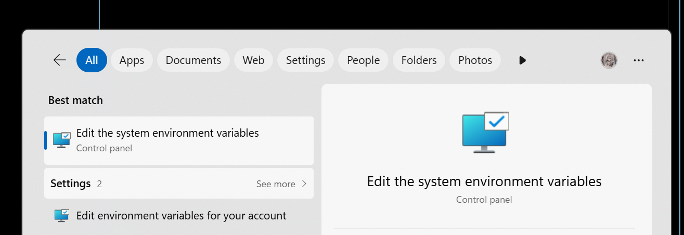
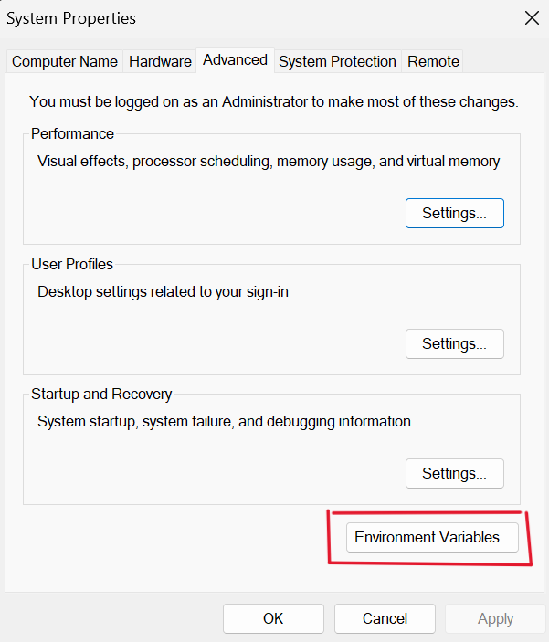
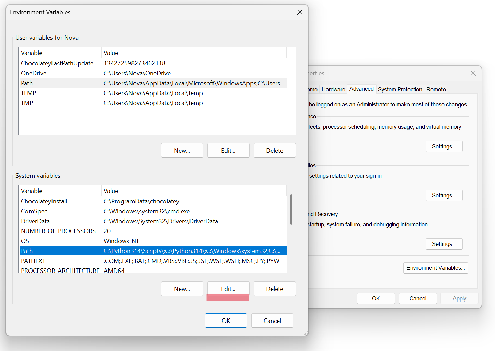
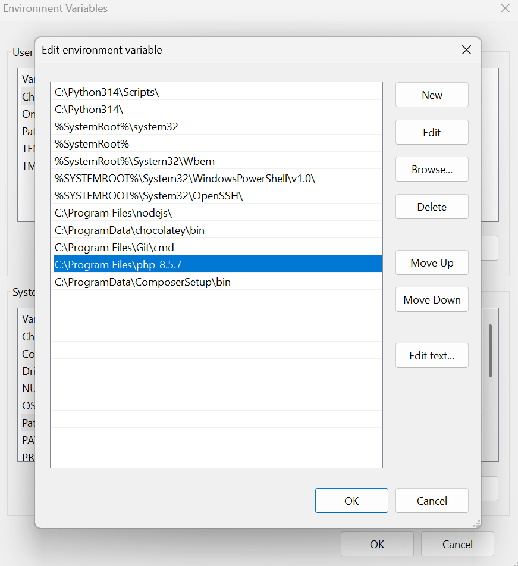
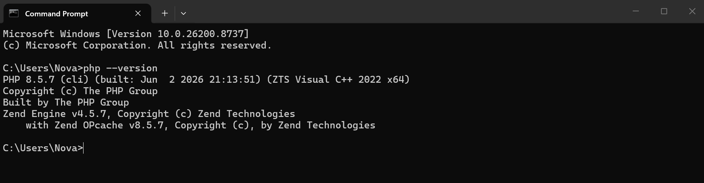
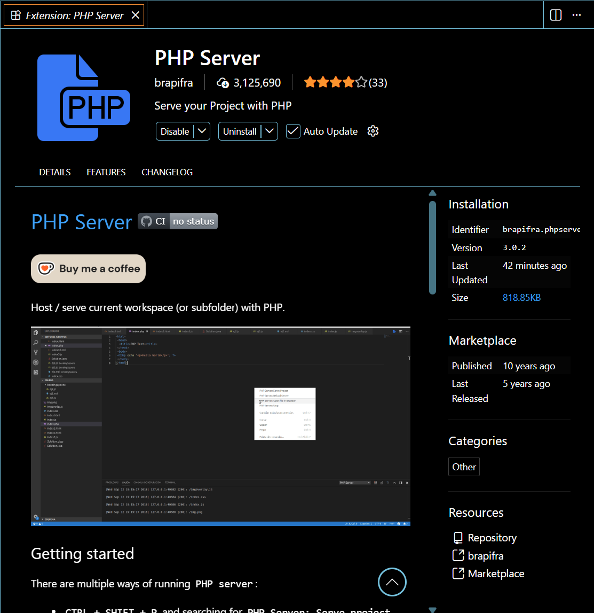
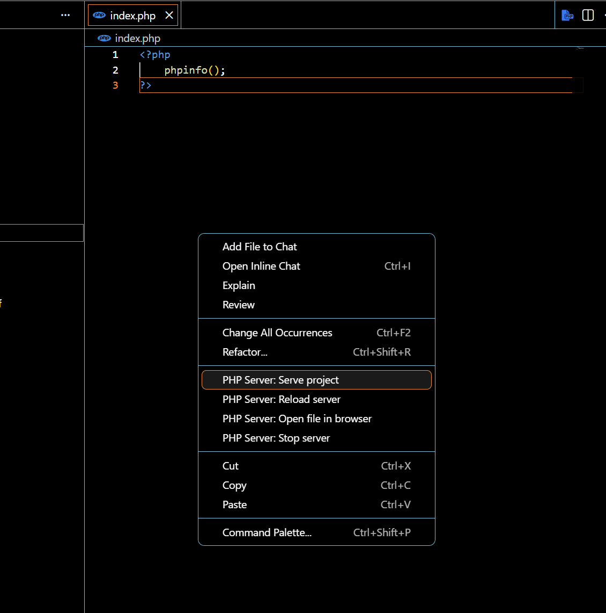
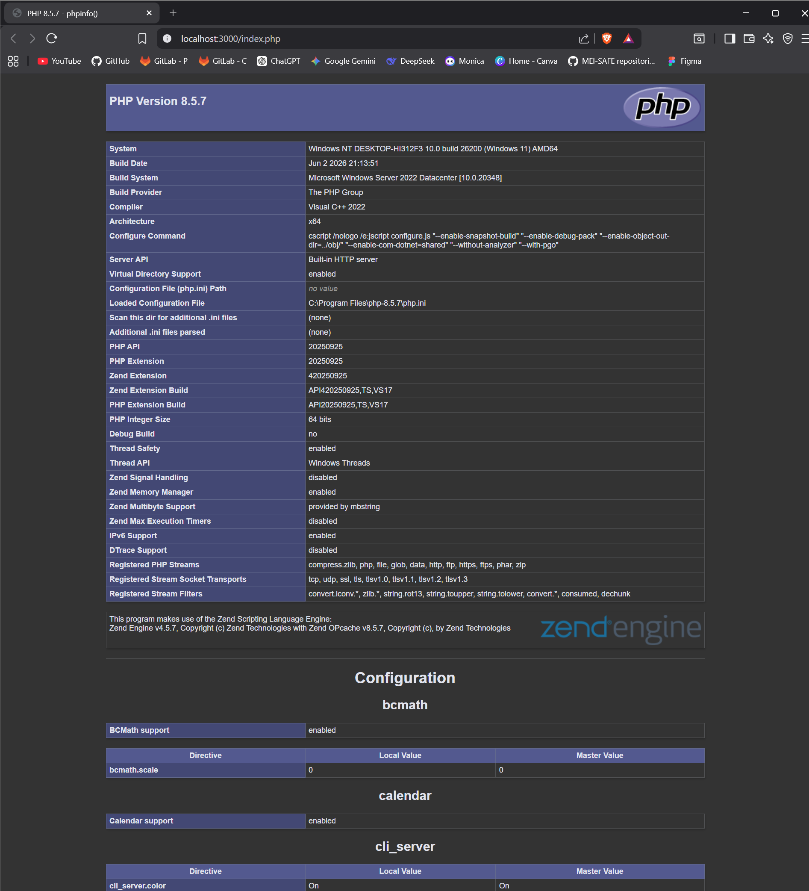

# Install php
## 1. Window OS
#### Step01: Go to php download page and select "Windows download"
>https://www.php.net/downloads.php

    

#### Step02: Extract the download file, Rename and copy to **C:\Program Files**

    

#### Step03: Copy Part **php**
>C:\Program Files\php-8.5.7

#### Step04: Configure system environment
>Start->Search for "Environment"

    

#### Step05: Open **Edit the system environment variables**

    

>Click **Environment Variables...**

#### Step06: Select **path** and click **edit** both in user variables and system variables

    

#### Step07: Click "New"->Input "C:\Program Files\php-8.5.7" and click "OK"->"OK"

    

#### Step08: Verify Installation
>php --version

    

## 2. MAC OS
>brew install php

## Install PHP Server in VS Code

    

---

## Create **lab.php** in VS Code
>Right click on the right and select "PHP Server: Serve project

    

>php info page is running

    

